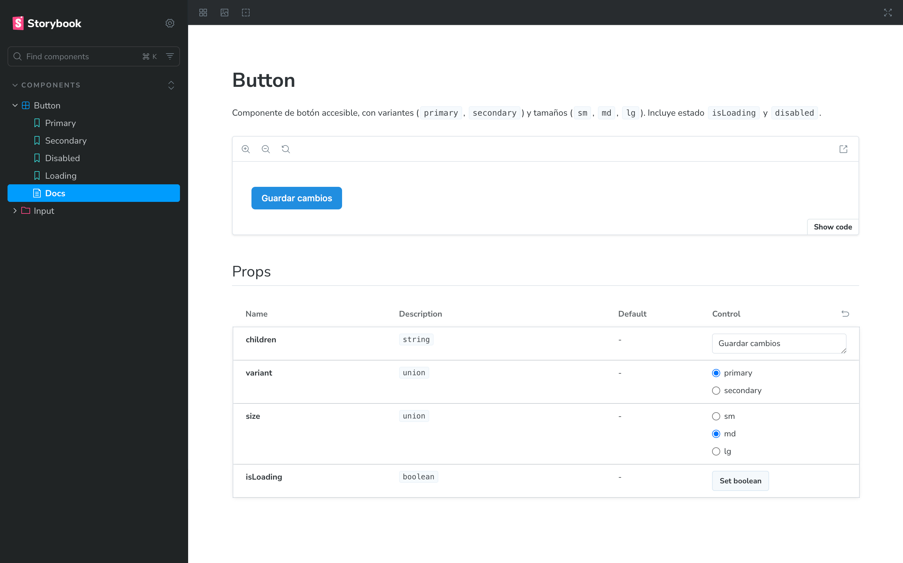

# Mi Librería de Componentes UI — React + TypeScript + Tailwind v4

[](https://ui-design-system-six.vercel.app/)

> 🔗 **Demo en Vercel:** https://ui-design-system-six.vercel.app/

Un catálogo personal de componentes de UI reutilizables, construido con React, TypeScript y las últimas características de **Tailwind CSS v4**

Este proyecto incluye **Storybook** para la documentación interactiva y visualización de componentes, y un **playground de Vite** separado para pruebas de integración y desarrollo rápido.

---

## ✨ Características

- ♿ Accesibilidad por defecto: `aria-*`, focus visible, estados `disabled/error`
- 🧩 Componentes iniciales: **Button**, **Input** (más en camino...)
- 🎨 Estilos con **Tailwind v4** (zero-config)
- 📚 **Storybook** con MDX + Controls + Addon A11y
- ⚡ Builder **@storybook/react-vite** y **Vite** para playground
- ✅ TypeScript estricto, ESLint + Prettier

---

## 🚀 Arranque rápido

### 1) Storybook

```bash
npm run storybook
# abre http://localhost:6006
```
